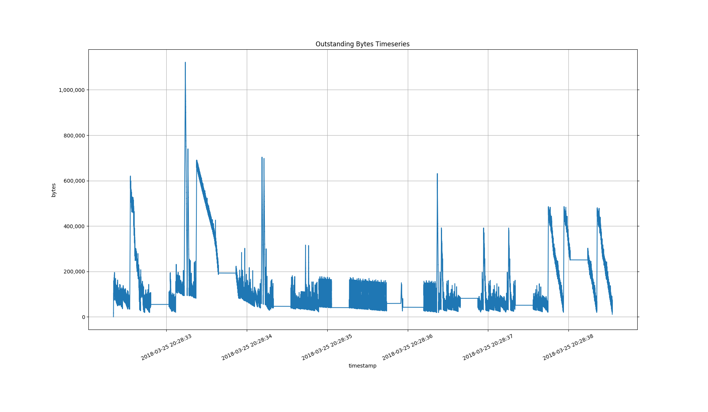

# heaptracker: A customizable library for tracking heap activity

This is a library to gain insight into the heap memory usage behavior.

# The problem

One of the common quests for any C++ program is to understand its
heap memory usage characteristics. Among them, perhaps the most
common question is

  - Is the program leaking memory?

Other common questions are:

  - What is the amount of memory allocated at this moment?
    - (or, at a specific moment)
  - What was the peak of memory allocation?
    - At what time did the peak happen?
    - ("peak" may be defined either in terms of number of allocations or number of bytes)
  - What is the total memory allocated in the life time of the program?

# The solution

This library, heaptracker, seeks to answer the above questions
and some more.

It is based on intercepting the heap APIs, i.e. the calls to
heap memory allocation (`malloc`, `calloc`, `realloc`) and
heap memory deallocation (`free`).

It supports two approaches of interception.
The first approach is to LD_PRELOAD a heaptracker
shared library that intercepts the calls to the heap APIs.
This can be used for any binary without requiring
any source code modification.
The second approach is for those applications that
use tcmalloc for memory management.
tcmalloc offers some "malloc hook" APIs to subscribe to and "listen"
to the heap API calls that heaptracker uses.

With the shared library based interception, the analysis is active
for the entire lifetime of the application.
tcmalloc based interception offers that too.
In addition, in tcmalloc based applications, heaptracker offers
programmatic control to the application by exposing APIs that can
start or stop the interception.

heaptracker allows the application to perform different kind
of analysis with different kinds of complexities.
For example, one application may just want to track the number of
outstanding allocations and the number of outstanding bytes
while another application may want to track the history of
each allocation and deallocation.
To facilitate such differing needs, heaptracker offers a
mechanism to let an application specify what exactly it wants
to be tracked.

The data obtained from tracking is given back to the application
by heaptracker using an observer interface.
An application is allowed to roll in a custom concrete observer
based on its analysis goals.
As examples, the library provides two ready-to-use observers (see below).

As an aside, the library has the following interesting usage.
When heaptracker is used in programatic control mode
(currently with tcmalloc), it can be used to measure the
heap memory footprint of an object in a generic way.
This, in general, is non-trivial
-- think for example a map or an unordered_map object --
since an object may consume multiple memory blocks
through many pointers, those memory blocks may have
pointers to more memory blocks and so on.

# Examples
## Summary observer
### Hello, World!

The following steps build the library and analyzes
an execution of the `/bin/echo` program.

    build$ ../cmake_interposition.sh
    build$ rm heap_tracker_observer_summary.output.txt
    build$ LD_PRELOAD=src/libheap_tracker_observer_summary_interposition.so \
      /bin/echo "Hello, World!"
    Hello, World!
    build$ cat heap_tracker_observer_summary.output.txt
    SummaryStats = {
      cumulative_alloc_count: 31,
      cumulative_free_count: 2,
      cumulative_alloc_bytes: 4705,
      cumulative_free_bytes: 1029,
      peak_outstanding_alloc_count: 30,
      peak_outstanding_alloc_count_instant: 2018-03-25 21:38:53.835147,
      peak_outstanding_alloc_bytes: 4700,
      peak_outstanding_alloc_bytes_instant: 2018-03-25 21:38:53.835147,
      outstanding_alloc_count: 29,
      outstanding_alloc_bytes: 3676,
    }

The output conveys that at the time of exit, the `/bin/echo` program
had 29 outstanding allocations which add up to 3676 bytes.
The peak memory usage was 4700 bytes.

### find

    build$ rm heap_tracker_observer_summary.output.txt; \
      LD_PRELOAD=src/libheap_tracker_observer_summary_interposition.so \
      /usr/bin/find /usr -type f -name 'stdio.h'
    /usr/include/stdio.h
    /usr/include/x86_64-linux-gnu/bits/stdio.h
    /usr/include/c++/7/tr1/stdio.h
    /usr/include/c++/5/tr1/stdio.h
    /usr/include/c++/6/tr1/stdio.h
    /usr/bin/find: ‘/usr/share/doc/google-chrome-stable’: Permission denied
    build$ cat heap_tracker_observer_summary.output.txt
    SummaryStats = {
      cumulative_alloc_count: 567733,
      cumulative_free_count: 567673,
      cumulative_alloc_bytes: 956052314,
      cumulative_free_bytes: 956041066,
      peak_outstanding_alloc_count: 3640,
      peak_outstanding_alloc_count_instant: 2018-03-25 21:41:28.551725,
      peak_outstanding_alloc_bytes: 1121974,
      peak_outstanding_alloc_bytes_instant: 2018-03-25 21:41:28.551725,
      outstanding_alloc_count: 60,
      outstanding_alloc_bytes: 11248,
    }
    
The output conveys that at the time of exit, the `/usr/bin/find` program
had 60 outstanding allocations which add up to 11K bytes.
The peak memory usage was 1.1M bytes.

The results are (expectedly) different when the same program
was run with different options.

    build$ rm heap_tracker_observer_summary.output.txt; \
      LD_PRELOAD=src/libheap_tracker_observer_summary_interposition.so \
      /usr/bin/find --help > /dev/null
    build$ cat heap_tracker_observer_summary.output.txt
    SummaryStats = {
      cumulative_alloc_count: 65,
      cumulative_free_count: 20,
      cumulative_alloc_bytes: 18963,
      cumulative_free_bytes: 10541,
      peak_outstanding_alloc_count: 47,
      peak_outstanding_alloc_count_instant: 2018-03-25 21:44:02.659133,
      peak_outstanding_alloc_bytes: 12606,
      peak_outstanding_alloc_bytes_instant: 2018-03-25 21:44:02.658810,
      outstanding_alloc_count: 45,
      outstanding_alloc_bytes: 8422,
    }

### Controlled example (from unit test)

HeapObserverSummary counts the number of allocations and dellocations.
It does not track the time history.
Here is an example with tcmalloc interception:

    build$ test/heap_tracker_test2_observer_summary
    SummaryStats = {
      cumulative_alloc_count: 35,
      cumulative_free_count: 33,
      cumulative_alloc_bytes: 166726364,
      cumulative_free_bytes: 166724364,
      peak_outstanding_alloc_count: 20,
      peak_outstanding_alloc_count_instant: 1969-12-31 16:00:00.000000,
      peak_outstanding_alloc_bytes: 166726008,
      peak_outstanding_alloc_bytes_instant: 1969-12-31 16:00:00.000000,
      outstanding_alloc_count: 2,
      outstanding_alloc_bytes: 2000,
    }

Along other things, it shows that, during the time heap tracking was
enabled, which in this case is the entire lifetime of the program,
there are 2 outstanding allocations which sum up to 2000 bytes.
Since allocation/deallocation time instants are not tracked,
the output shows the default timestamps.

## Time-series observer

HeapObserverTimeseriesFile tracks each allocation and deallocation
along with the time instant when the event happened and the full
callstack how the allocation happened.

    build$ test/heap_tracker_test_tcmalloc_timeseries_file
    Observer Timeseries saved to file heap_tracker_observer_timeseries_file.output.txt
    
    $ # two lines from heap_tracker_observer_timeseries_file.output.txt
    A 0x192e0c0 24 1516839274280396 callstack = { 0x7F10606500E3 0x7F10606408F7 0x7F1060640721 0x7F10603D43B2 0x7F10603E1670 0x40EA71 0x40E63F 0x40E03C 0x40D6AB 0x40CEB4 0x40C70C 0x40C14F 0x40BD3C 0x40B707 0x40B52A 0x7F105FA61830 0x40B469 } 
    D 0x192e0c0 24 1516839274280459 

The following table explains the above output.

    -----------------------------------------------------
    Column  | Explanation
    -----------------------------------------------------
    1       | 'A' mean allocation, 'D' means deallocation
    2       | the pointer allocated or deallocated
    3       | the size of allocation or deallocation
    4       | the timestamp, epoch in microseconds
    5-      | the callstack
    -----------------------------------------------------

The timeseries data can be analyzed offline using a heaptracker
tool to create a final report of the events that happened during
the data collection interval.

    build$ src/heap_tracker_observer_timeseries_file_decoder_tool \
      heap_tracker_observer_timeseries_file.output.txt
    <snippet>
    PointerToCallbackInfoMap: {
    ptr = 0x1938000, alloc_cb_info = ptr = 0x1938000, size = 1000, timepoint = 1516839274264478 callstack = { 0x7F10606500E3 0x7F10606408F7 0x7F1060640721 0x7F10603D43B2 0x7F10603E1670 0x40B63A 0x40B61D 0x40B629 0x40B520 0x7F105FA61830 0x40B469 } 
    ptr = 0x1938400, alloc_cb_info = ptr = 0x1938400, size = 1000, timepoint = 1516839274264571 callstack = { 0x7F10606500E3 0x7F10606408F7 0x7F1060640721 0x7F10603D43B2 0x7F10603E1670 0x40B63A 0x40B525 0x7F105FA61830 0x40B469 } 
    }
    
    Outstanding Report = {
    bytes = 1000, count = 1, callstack = { 0x7F10606500E3 0x7F10606408F7 0x7F1060640721 0x7F10603D43B2 0x7F10603E1670 0x40B63A 0x40B525 0x7F105FA61830 0x40B469 } 
    bytes = 1000, count = 1, callstack = { 0x7F10606500E3 0x7F10606408F7 0x7F1060640721 0x7F10603D43B2 0x7F10603E1670 0x40B63A 0x40B61D 0x40B629 0x40B520 0x7F105FA61830 0x40B469 } 
    }
    
    </snippet>

Note that the generated data can be large.
(It actually depends on the memory management pattern
-- the number of calls to allocation and deallocation --
of the observed program; the data generated is proportional to the number of calls.)

### Visualization

Convert the captured data to the graph input format.

    build$ src/heap_tracker_observer_timeseries_file_graph_input_tool \
      ./heap_tracker_observer_timeseries_file.output.txt > \
      ./heap_tracker_observer_timeseries_graph_input.txt

Run the python plotting tool on the graph input file.

    build$ python ../src/plot_timeseries_outstanding_bytes.py \
      ./heap_tracker_observer_timeseries_graph_input.txt

# Standard compliance

The library is compliant to the C++17 standard,
it is compiled with the following flags

    -std=c++17 -pedantic

It is expected to be portable.

Few other flags used are:

    -Wall -Wextra -Wshadow -Wnon-virtual-dtor -Wold-style-cast -Wcast-align
    -Wunused -Woverloaded-virtual -Wconversion 
    -Werror

# Build

The project is tested to build with clang++ (version 5.0) and gcc (version 7.2).

The following command builds tcmalloc based interception with gcc.

    cd build
    rm ./* -rf
    ../cmake_tcmalloc.sh

For interposition based interception with gcc, replace the last line with

    ../cmake_interposition.sh

For building and testing with clang use

    ../build_test_clang.sh

# A complete example

Build interposition libraries and tools.

    cd build
    rm ./* -rf
    ../cmake_interposition.sh

Remove previous data files, if any.

    build$ rm ./heap_tracker_observer_timeseries_file.output.txt \
      ./heap_tracker_observer_timeseries_graph_input.txt

Using LD_PRELOAD, run interposition based analysis on the Linux "find" command.

    build$ date; LD_PRELOAD=src/libheap_tracker_observer_timeseries_file_interposition.so \
      /usr/bin/find /usr -type f -name 'string.h'; date
    Sun Mar 25 20:28:32 PDT 2018
    <lot of */string.h file names, omitted here for brevity>
    Sun Mar 25 20:28:38 PDT 2018

Check output file generation.

    build$ ls -l heap_tracker_observer_timeseries_file.output.txt

Decode the output.

    build$ src/heap_tracker_observer_timeseries_file_decoder_tool \
      heap_tracker_observer_timeseries_file.output.txt
    Summary Stats = {
      cumulative_alloc_count: 567681,
      cumulative_free_count: 567621,
      cumulative_alloc_bytes: 955915203,
      cumulative_free_bytes: 955903955,
      peak_outstanding_alloc_count: 3639,
      peak_outstanding_alloc_count_instant: 2018-03-25 20:28:33.235570,
      peak_outstanding_alloc_bytes: 1121702,
      peak_outstanding_alloc_bytes_instant: 2018-03-25 20:28:33.235570,
      outstanding_alloc_count: 60,
      outstanding_alloc_bytes: 11248,
    }
    <lot more data, omitted here for brevity>
    Outstanding Report = {
    <omitted here for brevity>
    }

At the time the program /usr/bin/find exited, 11248 bytes were still allocated through 60 allocations.

Use the generated data to prepare input data for plotting.

    build$ src/heap_tracker_observer_timeseries_file_graph_input_tool \
      ./heap_tracker_observer_timeseries_file.output.txt > \
      ./heap_tracker_observer_timeseries_graph_input.txt

Plot the data.

    build$ python ../src/plot_timeseries_outstanding_bytes.py \
      ./heap_tracker_observer_timeseries_graph_input.txt

The generated plot looks like the following.

During the 6 seconds when the program (`/usr/bin/find`) ran,
it did `567681` allocations and `567621` deallocations, the outstanding
memory fluctuated a lot.
Observe that the peak outstanding bytes as reported by
the summary stats (`1121702` bytes at `2018-03-25 20:28:33.235570`)
matches with the peak in the plot.

# Tests

The following script builds everything with gcc and test them.

    test/run_all_tests_for_all_interceptions.sh

    build$ bash ../test/run_all_tests_for_all_interceptions.sh

It tests two kinds of interceptions:
  - Library call Interposition based
  - tcmalloc based

For each kind of interception, it tests two kinds of observers:
  - Summary observer
  - Timeseries observer (results saved to a text file)

# Coding style

The coding style is based on Google style guide with minor
changes, it is specified in the `.clang-format`.
Run `make_style.sh` to format the code as per this style.

# License

heaptracker is distributed under the terms of the BSD license,
see the file 'LICENSE' for exact details.
